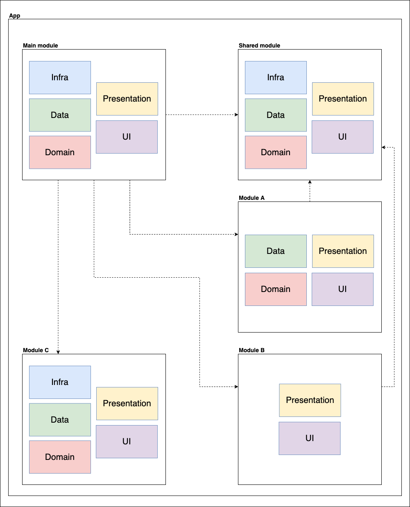
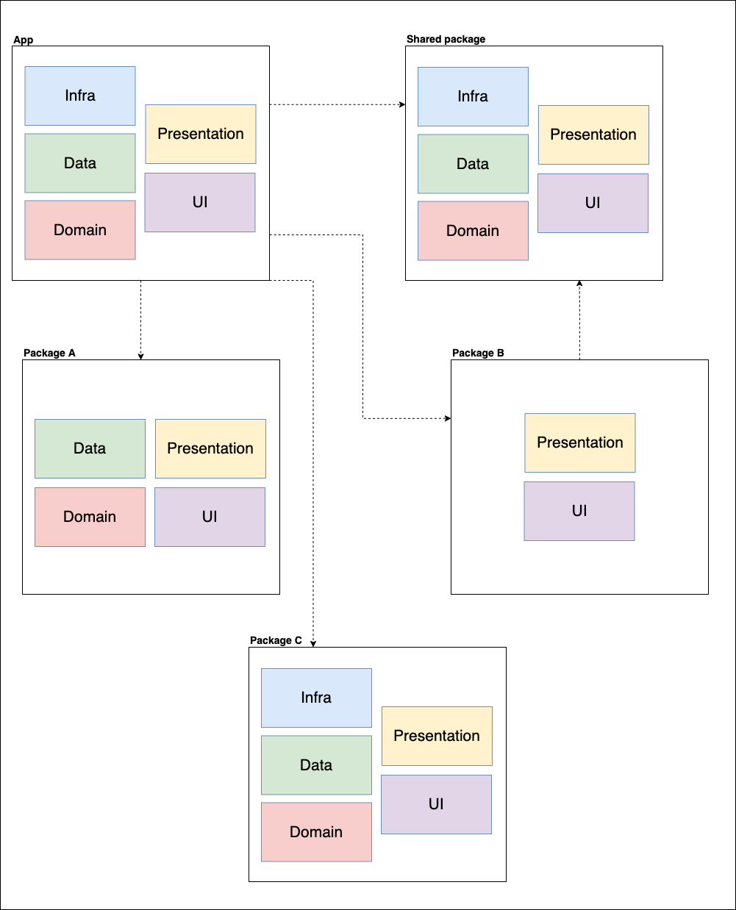

# Clean Architecture Proposal

Flutter app that implements a clean architecture proposal.

Its main use case is a lyrics search, using the [lyrics.ovh](https://lyricsovh.docs.apiary.io) free api.  

### Project architecture

  

### Branches
This project has some branches where specific tests were made.

Project division strategies:
  - [modular](https://github.com/emersonsiega/clean_architecture_proposal/tree/modular)  
  - [packages](https://github.com/emersonsiega/clean_architecture_proposal/tree/packages)

Changing dependencies without break other layers:  
  - [dio](https://github.com/emersonsiega/clean_architecture_proposal/commit/a371fdb59058deee68e222ed170585ed6dbf1742)  
  - [rxdart](https://github.com/emersonsiega/clean_architecture_proposal/commit/36b0c4dec53a36f8e01254de92921b6e2608cf0e)  

# Modular division

The branch [modular](https://github.com/emersonsiega/clean_architecture_proposal/tree/modular) contains this same project divided in modules.  

Each module is responsible for implement the architecture above, but only for its respective responsabilities (usecases, presenters, etc.).  

There's also a shared module, where information commom to all other modules is implemented.  

Maybe the [flutter_modular](https://pub.dev/packages/flutter_modular) package can help us in this scenario.  

## Modules architecture

  

**Pros:**   
- Keeps the business logic of a group of features closer to the place where it will be used.
- All instances created inside the module can be disposed when user "leaves the module".
- flutter_modular can be used as the main layer, coupling all modules together, using its dependency injection and routing system.

**Cons:**  
- Manage modules that depends of other modules can be very tricky.
- We can make the app extremely dependent of flutter_modular .  

# Package division

The branch [packages](https://github.com/emersonsiega/clean_architecture_proposal/tree/packages) contains this same project divided in local packgages.  

Like in modular, each package is responsible for implement the architecture above, but only for its respective responsabilities (usecases, presenters, etc.).  

There's also a shared package, where information commom to all other packages is implemented. All other packages uses this package as a dependency.  

## Packages architecture

  

**Pros:**  
- Specific documentation inside each package. Very useful for complex packages and for new developers to understand what that package does.  
- The test files stay closer to the implementations, inside the same package. 
- Commom packages can be imported in other projects (authentication, logging, etc.).
- All instances created for the package can be disposed when user "leaves the package".

**Cons:**  
- Manage packages that depends of other packages can be very tricky.
- How to solve the navigation between packages? (load local instances and dispose after use).
- How to solve internal page navigation?  
- There's nothing like flutter_modular to help with this approach.  

